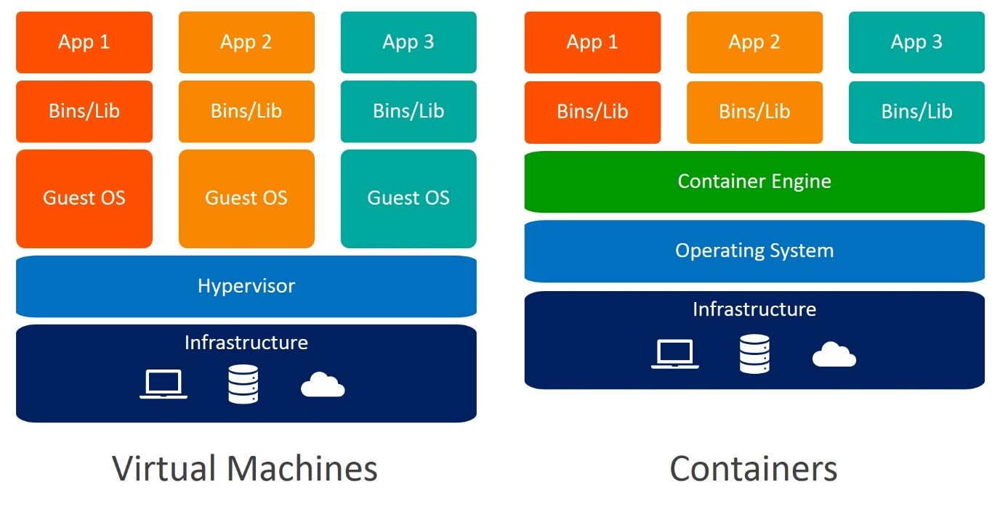
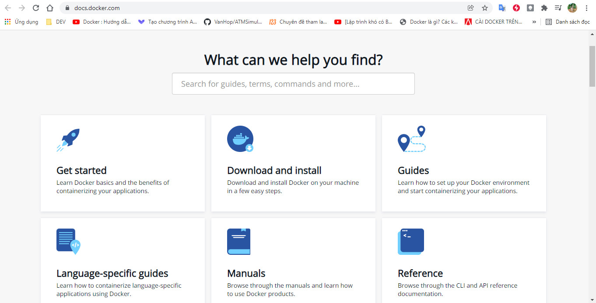
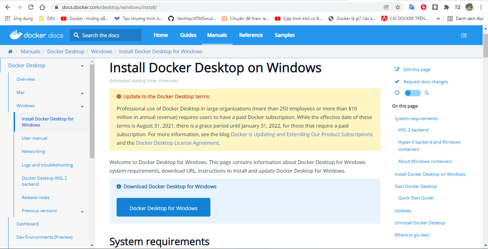
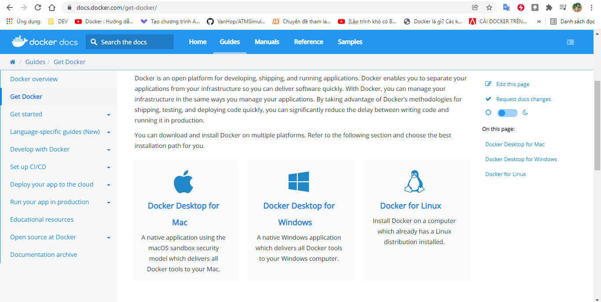
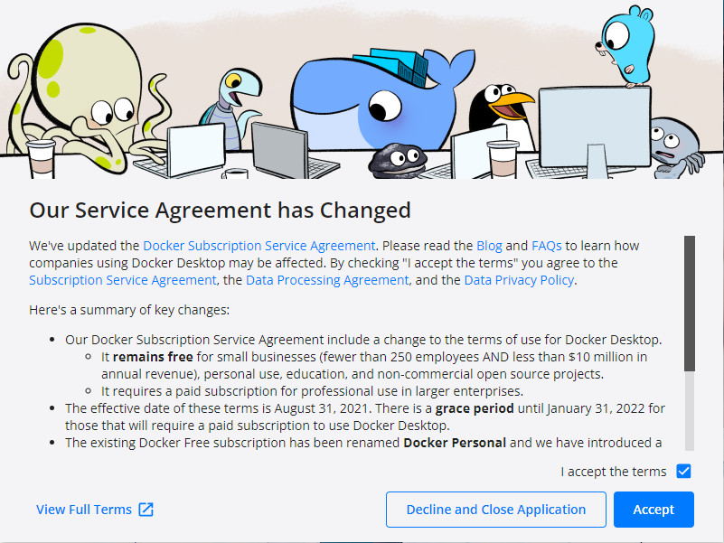
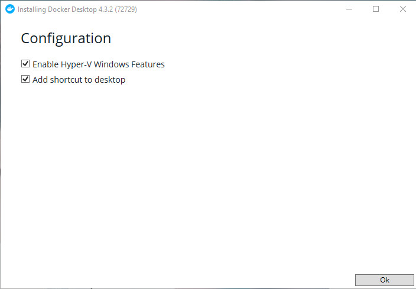
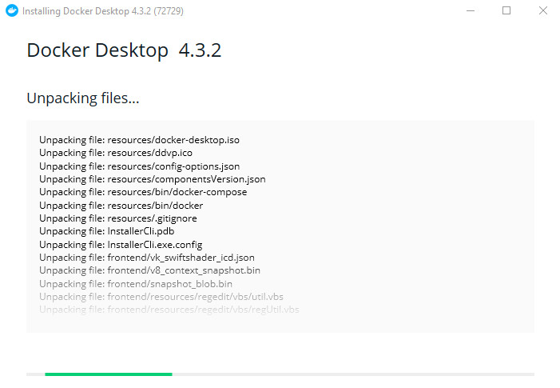
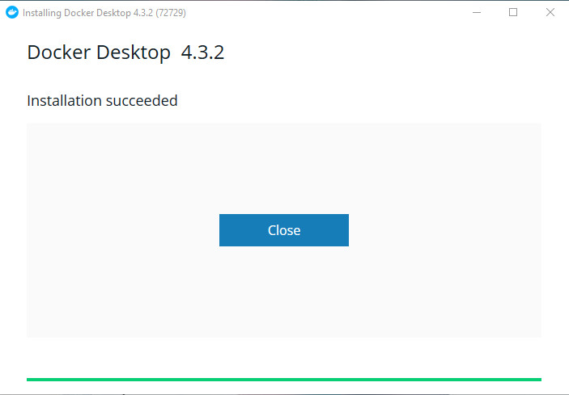

# AoHoa_Docker
# Thành Viên
| STT   | MSSV          | Họ Tên                |
| :---: | :---:         | ---                   |
| 1     | 2001190791    | Từ Huệ Sơn            |
| 2     | 2001190876    | Huỳnh Mỹ Trân         |
| 3     | 2001190679    | Lê Thùy Na            |
| 4     | 2001190523    | Phạm Kim Hoàng Hiến   |
# Tìm hiểu về Docker
## Docker là gì
**Docker** là một ứng dụng mã nguồn mở cho phép đóng gói các ứng dụng, các phần mềm phụ thuộc lẫn nhau vào trong cùng một container. Container này sau đó có thể mang đi triển khai trên bất kỳ một hệ thống Linux phổ biến nào. Các container này hoàn toàn độc lập với các container khác. Và thường ứng dụng cung cấp cách để building, deploying và running ứng dụng dễ dàng hơn bằng cách sử dụng các containers (trên nền tảng ảo hóa). Việc cần làm là chúng ta sẽ thiết lập cho app của mình các môi trường cần thiết với docker. Khi ai đó muốn chạy app đó thì chỉ cần chạy docker mà không cần phải cài môi trường cho app nữa vì docker đã giúp chúng ta xử lý hoàn toàn vấn đề này.<br>
Và Docker còn được biết là một ứng dụng mang lại lợi ích cho cả System administrator (SysAd), Developer (Dev) lẫn Devops. Đối với Dev, họ không cần phải biết nhiều về việc vận hành các chương trình, phần mềm phía dưới. Ngoài ra Dev cũng tận dụng được hàng nghìn các chương trình được đóng gói sẵn và chia sẻ trên mạng. Đối với SysAd, Docker mang đến sự linh hoạt trong quản lý, tăng khả năng tận dụng tài nguyên hệ thống. Đối với Devops, lợi ích chính là tận dụng cả hai lợi ích ở trên. 
# Sự khác biệt của Docker và Virtual Machine 

## So sánh sự khác biệt
| Virtual Machines | Docker |
| :--- | :--- |
| Kích thước (dung lượng) lớn | Kích thước (dung lượng) nhỏ | 
| Hiệu suất hạn chế | Hiệu suất gốc (native) | 
| Mỗi máy ảo sẽ có 1 hệ điều hành riêng | Container sẽ sử dụng hệ điều hành của host | 
| Ảo hóa về mặt phần cứng | Ảo hóa về mặt hệ điều hành |
| Thời gian khởi động tính theo phút | Thời gian khởi động tính theo mili giây |
| Phân bổ bộ nhớ theo nhu cầu cần thiết | Yêu cầu ít dung lượng bộ nhớ hơn |
| Hoàn toàn bị cô lập và an toàn hơn | Cô lập ở mức tiến trình, có thể kém an toàn hơn |
# Cài đặt Docker
- Tiến hành truy cập [https://docs.docker.com/](https://docs.docker.com/) để tải docker cũng như tài liệu của docker<br/><br/>

- Nhấn chọn **Download and install**<br/><br/>

- Nhấn chọn **Docker Desktop for Windows** và chọn phiên bản để tải về<br/><br/>

- Tiến hành cài đặt docker<br/><br/>




# Cách sử dụng
## Xem version của docker
```bash
docker --version
```
## Hiển thị các container đang hoạt động
```bash
docker ps
```

```bash
docker run -d -p 80:80 docker/getting-started
```
# Video demo